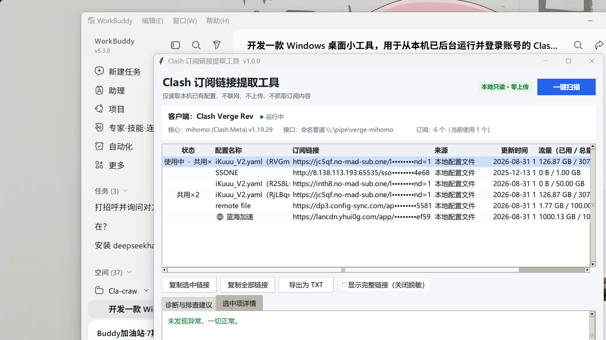

# Clash SubScope · 订阅透镜

> 🔍 **一键提取本机 Clash 客户端的订阅链接** —— 仅读本地、默认脱敏、零上传。

[](LICENSE)
[]()
[]()
[]()
[]()

> 🔍 **One-click extract subscription links from your local Clash clients** —
> read-only · masked by default · zero upload.

---

## 📥 下载（免 Python 环境）

不想装 Python / 依赖？直接去 Releases 下载打包好的单文件 exe：

- 👉 [clash-subscope.exe（v1.2.2）](https://github.com/cv-superding/clash-subscope/releases/download/v1.2.2/clash-subscope.exe)

双击即可运行（Windows 10 / 11）。同样遵循「仅读本地、默认脱敏、零上传」的隐私承诺。

---

## 为什么做这个

Clash 系客户端（包括 Clash Verge Rev / Clash for Windows / FlClash / Nyanpasu /
独立 mihomo 核心）的订阅地址都保存在本机配置文件里，但它们不给你任何"复制订
阅链接"的可点击按钮，只能从 `%APPDATA%` 下的 YAML 文件里翻找。

当你想：
- 在另一台设备上用同一个订阅
- 把订阅迁移到另一个客户端
- 备份当前正在用的订阅
- 排查某个订阅有没有过期
- 写一个属于你自己的订阅管理脚本

……的时候，本工具就是为此存在的。

---

## ✨ 特性

| 功能 | 描述 |
| --- | --- |
| 🖱️ 一键扫描 | GUI 单按钮，自动找出本机已安装的所有 Clash 客户端 |
| 📋 完整订阅列表 | 按配置名称逐一列出，每条都给出客户端、来源、更新/流量/到期 |
| 🎯 当前配置高亮 | 运行时能拿到核心当前生效配置，会在表格里加"使用中"标记 |
| 🔄 多客户端并存 | 同台机器装多个 Clash（Verge + FlClash + CFW 等）都识别 |
| 🔁 重复链接提示 | 同一个 URL 被多个配置引用时，状态列显示「共用×N」 |
| 🕶️ 默认脱敏 | 链接前 30 字符 + 中段打码 + 末尾 4 字符；可一键切换明文 |
| 📎 一键复制 | 单条 / 全部，复制到剪贴板 |
| 💾 导出 TXT | 完整可读文本，含每条配置的全部信息 |
| ➕ 一键导入到 Clash | 粘贴朋友的订阅链接 → 工具自动**先关闭正在运行的 Clash**（避免写入被覆盖）、**临时关闭系统代理**（避开代理导致的 HTTP/2 中断 / 403），把链接写进本机客户端的 `profiles.yaml`，再让你重新打开 Clash、点更新、最后点「恢复代理」 |
| 🔧 运行时探测 | 同时支持 TCP（`external-controller`）与 Windows 命名管道（`external-controller-pipe`），核心关闭 TCP 时自动回落管道 |
| 🌐 全中文界面 | 现代化浅色主题（ttkbootstrap / cosmo），统一圆角按钮、原生风格对话框与滚动条，无任何依赖外网的服务 |

---

## 🛡️ 隐私与安全（请务必先读这一节）

**这是这个项目最在意的一条承诺：如果你的环境不允许，把工具扔掉也无所谓，但
这几点不能含糊：**

1. **不访问任何外网。**
   运行时接口（用于读取核心版本 / 节点数）只连 `127.0.0.1` 或本机命名管道。
   它绝不会对你列出的订阅链接发起任何请求。
2. **不上传任何数据。**
   工具全程没有"埋点"、没有"数据回传"、没有"配置文件同步"。复制 / 导出按
   用户在 UI 上的按钮触发，确认后写入本地文件，不与任何服务端通信。
3. **不尝试破解加密的客户端配置。**
   部分 Clash for Windows 0.20+ 会把 `profiles.yml` 加密存储。工具会明确提示
   "疑似已加密或已损坏"，并指引用户在客户端内关闭加密，但**绝不调用任何解密
   函数、绝不绕过认证**。
4. **默认打码显示订阅链接。**
   中段打码，仅保留前 30 / 末尾 4 字符。即使有人在你旁边也不容易窥到完整链接。
   想要明文时手动勾选"显示完整链接"。
5. **完全离线运行。**
   工具本体不需要安装包以外的任何下载；只需 Python + `PyYAML` + `psutil`。
   `pip install -r requirements.txt` 装完之后离线启动零网络请求。

> 如果你愿意审计源码：所有读写路径都在 `clash_sub_tool/` 下，搜索关键字
> `urlopen` / `http.client` / `requests` 都搜不到（不是没找到，是真的没有）。

---

## 📸 截图



*Clash Verge Rev 下的订阅配置列表：当前正在使用的配置用浅蓝高亮，
同一链接被多个配置共用时在状态列显示「共用×N」。底部诊断区为空表示一切正常。*

---

## 📦 安装

### 方式 1：双击启动器（推荐）

仓库自带 `clash-subscope.bat`：

```bat
:: 双击即可
clash-subscope.bat
```

启动器默认指向 `C:\Users\29436\anaconda3\pythonw.exe`。**如果你的 Python
不在这个路径**，用任意编辑器打开 `.bat`，把 `PYTHONW` 改成你自己的
`pythonw.exe` 路径，再保存后双击。

### 方式 2：手动启动

```bat
:: 安装依赖
pip install -r requirements.txt

:: GUI 需要 pythonw（不是 python），避免弹出黑色控制台窗口
pythonw main.py
```

### 依赖

```
PyYAML >= 6.0      解析 profiles.yaml / profiles.yml / config.yaml
psutil >= 5.9      枚举本机进程，识别 Clash 主程序是否运行
```

Python 3.8+。Windows 10 / 11 实测通过。

---

## 🚀 使用

1. 双击 `clash-subscope.bat`，GUI 启动后自动扫描一次。
2. **状态卡片**告诉你 Clash 客户端的运行情况、核心版本、控制器通道。
3. **订阅表格**列出所有订阅配置。
4. 想要某一条链接 → 选中 → 「复制选中链接」。
5. 想要全部 → 「复制全部链接」。
6. 想存档 → 「导出为 TXT」。
7. 看到明文需要勾选「显示完整链接（关闭脱敏）」，导出同理。
8. 选一行后切到「选中项详情」tab 看完整 metadata。
9. **把一条订阅导入到本机 Clash**：在顶部「导入订阅到 Clash」框粘贴链接（或从表格选中一行点「导入选中到 Clash」）→ 确认后，若 Clash 正在运行工具会**先自动关闭它**，再临时关闭系统代理并写入 `profiles.yaml`。写完后**重新打开 Clash Verge Rev**，在订阅上点「更新」拉取节点，最后点本工具「恢复代理」重新开梯子。

---

## 🔍 支持的客户端

| 客户端 | 配置文件 | 数据目录（默认） |
| --- | --- | --- |
| **Clash Verge Rev** | `profiles.yaml` | `%APPDATA%\io.github.clash-verge-rev.clash-verge-rev` |
| Clash Verge（旧版） | `profiles.yaml` | `%APPDATA%\io.github.clash-verge.clash-verge` 等 |
| Clash Nyanpasu | `profiles.yaml` | `%APPDATA%\top.gydong.clash.nyanpasu` |
| FlClash | `profiles.yaml` | `%APPDATA%\com.follow.clash` 等 |
| Clash for Windows | `profiles.yml` | `%APPDATA%\Clash for Windows` |
| Mihomo / Clash.Meta（独立核心） | `config.yaml` | `%USERPROFILE%\.config\clash` 等 |

如果客户端用了自定义数据目录（绿色版），只要位于上述常见路径下即可被自动
找到。要加新客户端只需在 `clash_sub_tool/clients.py` 的 `CLIENT_DEFS` 加一
项。

### 运行时接口通道

| 通道 | 何时使用 | 实现 |
| --- | --- | --- |
| TCP `127.0.0.1:9090` | 客户端开启 `external-controller` | `socket.create_connection` |
| Windows 命名管道 | `external-controller-pipe: \\.\pipe\verge-mihomo` | ctypes `CreateFileW` + 手工 HTTP/1.1 + chunked |

工具会先并行 TCP 端口探测（0.3s 总超时），找不到时自动回落命名管道。
**端口候选取自配置文件 + 一组默认值**，不依赖单一预设。

---

## 🩺 常见问题与排查

| 现象 | 可能原因 | 排查建议 |
| --- | --- | --- |
| 列表为空 | 客户端用了非默认数据目录（绿色版） | 把配置目录挪到常见路径，或参考 `clients.py` 加新条目 |
| 状态卡"未运行" | 主程序未启动，但有后台服务 | 启动客户端主程序；后台服务（`clash-verge-service.exe` / `FlClashHelperService.exe`）不算"已打开" |
| "配置文件疑似已加密" | Clash for Windows 0.20+ 默认加密 | 在 CFW 内关掉配置加密并重新保存 |
| "权限不足" | 在受限账户下运行 | 用有读取 `%APPDATA%` 权限的账户 |
| "未能连接运行时接口" | 控制器被关 / 密钥不对 | 在客户端内开启外部控制器；密钥默认是 `set-your-secret`（出厂默认，不是占位符） |
| 双击 .bat 报一堆乱码 | `.bat` 被错误地存为 UTF-8 | 用记事本"另存为 ANSI 编码"覆盖 |
| 导入订阅时报 `http2 error` / 403 | 系统代理（梯子）把订阅拉取请求绕去了出口 IP，被服务端中断或拦截 | 用本工具的「导入到 Clash」会自动临时关代理；或手动关掉梯子代理、直连家宽后再导入，成功后再开回 |
| 导入后要重启 Clash 才生效 | 客户端运行时可能覆盖 `profiles.yaml` | 导入前先完全退出 Clash 主程序，或导入后重启一次再「更新」订阅 |
| 启动很慢 | 第一次扫描需要遍历多个目录 | 仅扫描一次，结果会一直留在表格里；后续「一键扫描」可手动按 |

---

## 🏗️ 项目结构

```
clash-subscope/
├─ main.py                       入口（设置 DPI awareness 后启动 GUI）
├─ clash-subscope.bat            Windows 启动器（GBK + CRLF）
├─ requirements.txt              PyYAML / psutil
├─ LICENSE                       MIT
├─ README.md                     本文件
├─ docs/
│  └─ screenshot.png             README 引图
├─ .gitignore                    忽略 _scratch/、__pycache__ 等
├─ clash_sub_tool/
│  ├─ __init__.py
│  ├─ models.py                  数据模型
│  ├─ clients.py                 客户端定义与本机发现
│  ├─ parsers.py                 各类 profiles 解析
│  ├─ importer.py                写订阅到客户端（导入功能，唯一写操作）
│  ├─ proxymgr.py                Windows 系统代理的临时关闭/恢复
│  ├─ runtime.py                 运行时接口（TCP + 命名管道）
│  ├─ scanner.py                 编排
│  ├─ formatting.py              脱敏、流量、到期、导出
│  └─ ui.py                      tkinter 桌面 GUI
└─ .workbuddy/memory/            作者本人的开发日志（不影响工具运行）
```

---

## 🤝 致谢

- [mihomo / Clash.Meta](https://github.com/MetaCubeX/mihomo) —— 一个能在
  Windows 命名管道上跑 HTTP 外部控制器的优秀核心，本工具的运行时通道完全
  围绕它设计。
- [Clash Verge Rev](https://github.com/clash-verge-rev/clash-verge-rev)
  及其上游，本工具默认兼容它的 `profiles.yaml` 格式。
- 所有 [PyYAML](https://pyyaml.org/) / [psutil](https://github.com/giampaolo/psutil)
  / [Tk](https://www.tcl-lang.org/) 的维护者。

---

## 📄 许可证

本项目使用 [MIT License](LICENSE)。简单说：随便用，署名原作者即可，不担
保任何问题。

如果你基于这个工具做了改进版本，欢迎回来提 PR 或在 Issues 告诉我。